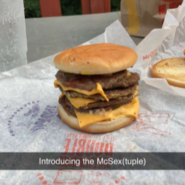

# Fast Food Omakase

Omakase (Japanese: お任せ, Hepburn: *o-makase*) is a Japanese phrase, used when ordering sushi in restaurants, that means "I'll leave it up to you".

This app is a social networking scrapbook for your fast food creations. "Creations", what? Yes, creations. This app was born after the creation of the McSex.

 Your eyes do not decieve you, that is a 6 patty burger -- three McDoubles stacked together, all topping present and the interior buns removed. 
 
 It's recommended to try the McSex, or any creation recommendations, around lunch time to attain the freshest ingredients. The original was paired with a Sprite, just in case you are looking for the most pure experience.